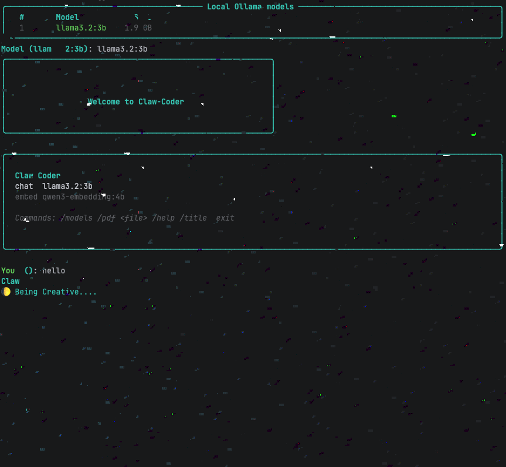

# Claw Coder


### Claw coder is a local first AI agent that turns local coding small LLMs into powerful AI agents that actually work here is how:
#### Claw coder has access to knowledge graph which means it can ingest files and directories and actually map them and understand what each part does to the other without even needing powerful GPUs and the knowledge graph is lightweight which means it runs completely on you laptop

# Claw-Coder Versions
> Claw-Coder has gone through a huge amount of versions and upgrades in a very short time
>
> - The biggest versions are:
> 1) Claw-Coder v0.1.0 to v0.2.0 -> These versions are claw-coder were the versions with an old ui as you can see below
>  
> 2) Claw-Coder v0.2.0 to v0.3.4 -> These versions got a new look and some versions in the v0.2.0 family and this new ui was created with rich as you can see below
> 
> 3) Claw-Coder v0.3.0 to v0.4.23 - latest as of 2026/07/22 -> These versions got a new sign in flow and pinging we are trying to get accurate numbers on the people we are actually serving as the creators of Claw-Coder but the npm numbers can be real or not we have introduced pinging since claw-coder is fully local we want to help as many people as we can so pinging allows us to collect feedback from you directly without forcing you to enter forms this pinging will show us the worst commands and the best, the worst ux and the best ui we are actively making claw-coder the best of all time so thank you for understanding we are going to be very transparent about this feature.

> - Claw coder has access to tree-sitter     dss+ RAG which is put in place just for the coding purpose only but the RAG is designed for both functionalities like for code and documents which means the local model can actually map relationships precisely with the help of knowledge graphs which is a powerful combination
> 
> 
> - Claw coder also has access to tools the elevate its power with real codebases:
## Tools include:

---
- Docker coder execution: Giving an AI agent docker code execution does not only improve coding performance and reasoning but also enables it to execute broken and working code all in isolated environment without destroying your venv.
---
- Search tools: Local AI and all of LLMs in general can't reason beyond their trained data which can lead to hallucinations but when given access to a search tool the hallucinations drop dramatically by up to 70%+ because it now has up_to_date information.
---
- Run tests: LLMs in general not only the local ones can write 1000s of lines of code that do not make sense from even the top to the last line but when given a test tool they can test their code and see where they went wrong and claw-coder is actually good with this coz it can even test html and css code and actually see the output on the web.
---
  - git tools: Not considering git for AI agents can look like something easy to slide and leave on the side because it looks useless but giving git to AI agents is not a luxury necessity but it enables the AI agent to check what changed and where and why and actually be a full AI engineer on your laptop on your lap completely local.
---
  - file tools: These are actually the tools that make an agent code in a real file and clear mistakes and these tools really help the agent just do its work outside the terminal.
---
### These are powerful tools but isn't it better to just use existing agents and configure them?:
### Well this is a good question but the is something to point out:

---

````
|______________________________________________________________________________________________________________________________________________________|
|__________|Runs locally|Repository understanding|Gives performance without compromaising security and privacy  |Code reasoning locally                |
|Cursor    |No          |Yes                     |No                                                            |No                                    |
|Codex     |No          |Yes                     |No                                                            |No                                    |
|Claw-coder|Yes         |Yes                     |Yes                                                           |Yes                                   | 
|Claude    |No          |Yes                     |No                                                            |No                                    |
|__________|____________|________________________|______________________________________________________________|______________________________________|
````
- ### Caution: Claw-Coder is indeed something else, but it is not perfect it can make mistakes and mess up don't be too open to claw-coder with your environment.
- ### But this has been thought of at the file stage, the AI has a directory called workspace where it works from without destroying your file structure.

---

### Now time to install and have fun with claw-coder.

---
## Install

---

From this directory:

```bash
npm install -g claw-coder
claw setup
claw login  - this signs you up so you can get the full capabilities of claw-coder
```
---
For development, use a symlink instead:

---
> TIP
> 
> - `claw setup` installs the Python dependencies from 
> 
> - `requirements.txt`. 
Ollama shall start running for every chat and after claw setup, embeddings, and vector RAG:
---
```bash
ollama serve for old versions of claw-coder but its not needed for new versions for it is initialized automatically after claw-chat.
claw <model>
claw <chat model> <embedding modal>
the code you see above is for claw-coder old versions but is still functional but not needed for the claw-coder experience
```
---
## Usage

```bash
claw doctor # checks whether everything is all set
claw languages # displays languages supported by claw-coder's tree sitter ability
claw ingest . # ingests the contents of the current directory into the knowledge graph
claw graph "tree_sitter imports" # gets info from the knowledge graph and search for imports of tree-sitter used in a project
claw search "where is graph reranking implemented?" --top-k 5 # this does the same but goes in depth
claw chat # this activates an ollama serve in the background and checks whether its on and then makes claw-coder work as nowmal
```
- This is a screenshot of claw --help with all the commands displayed


---
Useful options:

```bash
claw ingest ./src --no-vector-rag
claw search "authentication flow" --graph ./my_graph.json --db ./rag_db
claw graph "calls run_terminal" --top-k 10 --depth 3
```

### This is a credit based product so the powerful tools like docker execution and so much more while be credit based.

- To check your usage you run
```bash
claw usage
````


---
You can also use the longer binary name:

```bash
claw-coder doctor
```
---
Sign in and log in:
```bash
claw login
```
---
## Caution:
```bash
claw chat  # in the latest version includes a new workspace feature that is mostly a paid feature
# most of the tools are limited and are paid for to unlock the limit for a month
```
> Source Code: [claw-coder](https://github.com/gabriel-c70/Claw-Coder.git) 
>
> You can also contribute and make [claw-coder](https://github.com/gabriel-c70/Claw-Coder.git) the best AI agent ever created by just contributing a line of code.
---
