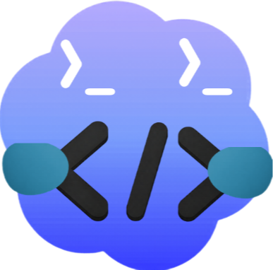
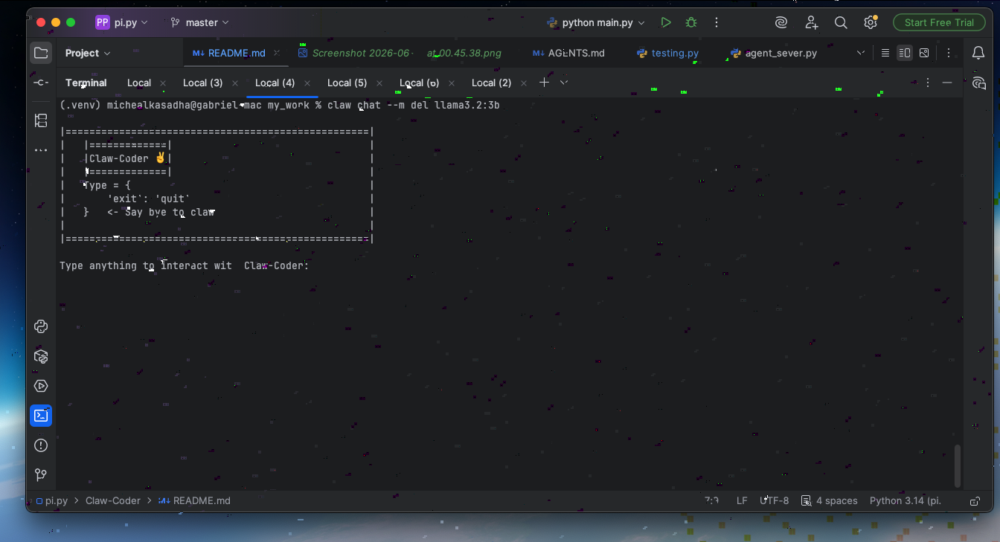
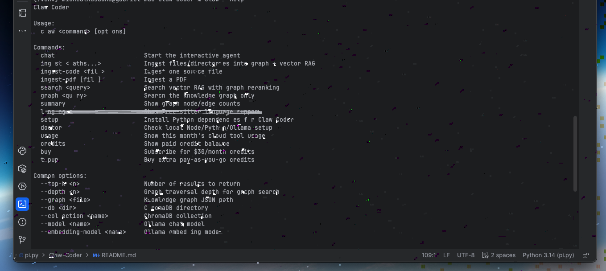
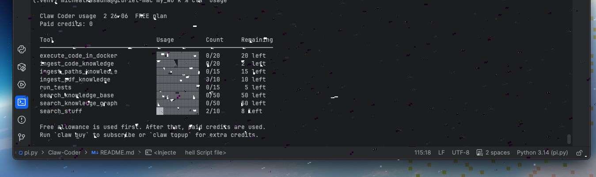

# Claw Coder



**Claw Coder is a local-first AI agent that turns small local coding LLMs into powerful AI agents that actually work.**

It gives your local model a lightweight **knowledge graph** so it can ingest files and directories and actually map what each part of your codebase does in relation to the others — without needing powerful GPUs. The graph is lightweight enough to run completely on your laptop.



---

## Table of Contents

- [How it works](#how-it-works)
- [Tools](#tools)
- [Why not just configure an existing agent?](#why-not-just-configure-an-existing-agent)
- [Installation](#installation)
  - [Homebrew (macOS / Linux)](#homebrew-macos--linux)
  - [Scoop (Windows)](#scoop-windows)
  - [From source (npm)](#from-source-npm)
- [Setup](#setup)
- [Usage](#usage)
- [Billing & credits](#billing--credits)
- [What's new](#whats-new)
- [Contributing](#contributing)

---

## How it works

Claw Coder pairs **tree-sitter + RAG** (designed for both code and documents) with a knowledge graph, so the local model can map relationships precisely — a powerful combination for real coding work.

---

## Tools

Claw Coder ships with tools that elevate its power on real codebases:

- **Docker code execution** — runs broken and working code in an isolated environment, improving coding performance and reasoning without destroying your venv.
- **Search tools** — local LLMs can't reason beyond their training data, which causes hallucinations; a search tool drops hallucinations dramatically (up to 70%+) by giving up-to-date information.
- **Run tests** — lets the agent test its own code (including HTML/CSS, with real web output) and see where it went wrong instead of writing 1000s of lines that don't make sense.
- **Git tools** — lets the agent see what changed, where, and why, so it can act as a full AI engineer locally.
- **File tools** — let the agent edit real files and fix mistakes outside the terminal.

---

## Why not just configure an existing agent?

A fair question — but here's the key difference:

| | Runs locally | Repository understanding | Performance without compromising privacy | Code reasoning locally |
|---|:---:|:---:|:---:|:---:|
| Cursor     | No  | Yes | No  | No  |
| Codex      | No  | Yes | No  | No  |
| **Claw-Coder** | **Yes** | **Yes** | **Yes** | **Yes** |
| Claude     | No  | Yes | No  | No  |

> **Caution:** Claw-Coder is powerful but not perfect — it can make mistakes, so don't be too open with your environment. This was considered at the file stage: the agent works from a dedicated `workspace` directory so it won't destroy your file structure.

---

## Installation

Claw Coder installs the `claw` command. Pick the method for your platform.

### Homebrew (macOS / Linux)

```bash
brew tap gabriel-c70/claw-coder
brew install claw-coder
claw setup
```

### Scoop (Windows)

```powershell
scoop bucket add claw https://github.com/gabriel-c70/homebrew-claw-coder
scoop install claw-coder
claw setup
```

### From source (npm)

From this directory:

```bash
npm install -g .
claw setup
```

For development, use a symlink instead:

```bash
npm link
claw setup
```

---

## Setup

`claw setup` installs the Python dependencies from `requirements.txt`. You also need **Ollama** running for chat, embeddings, and vector RAG:

```bash
ollama serve
claw <chat model> <embedding model>
```

Verify your environment at any time:

```bash
claw doctor
```

---

## Usage

```bash
claw doctor
claw languages
claw ingest .
claw graph "tree_sitter imports"
claw search "where is graph reranking implemented?" --top-k 5
claw chat
```

This is a screenshot of `claw --help` with all the commands displayed:



**Useful options:**

```bash
claw ingest ./src --no-vector-rag
claw search "authentication flow" --graph ./my_graph.json --db ./rag_db
claw graph "calls run_terminal" --top-k 10 --depth 3
```

You can also use the longer binary name:

```bash
claw-coder doctor
```

Sign in / log in:

```bash
claw login
```

---

## Billing & credits

This is a credit-based product — powerful tools like Docker execution (and more) are credit-based. To check your usage:

```bash
claw usage
```



---

## What's new

- **Homebrew tap + Scoop bucket** — install on macOS, Linux, and Windows with a single command (see [Installation](#installation)). Package definitions live in [gabriel-c70/homebrew-claw-coder](https://github.com/gabriel-c70/homebrew-claw-coder).
- **Isolated Python environment** — the Homebrew/Scoop installs create a dedicated virtualenv so `claw setup` installs dependencies without touching your system Python.
- **`claw doctor`** — checks your Node, Python, Ollama, and Python-package setup in one command.
- **Dependency fix** — `requirements.txt` now includes the core `tree-sitter` package (the grammars alone weren't enough) so RAG/graph parsing works out of the box.

---

## Contributing

> Source code: [claw-coder](https://github.com/gabriel-c70/Claw-Coder.git)
>
> You can contribute and help make [claw-coder](https://github.com/gabriel-c70/Claw-Coder.git) the best AI agent ever created — even a single line of code helps.
